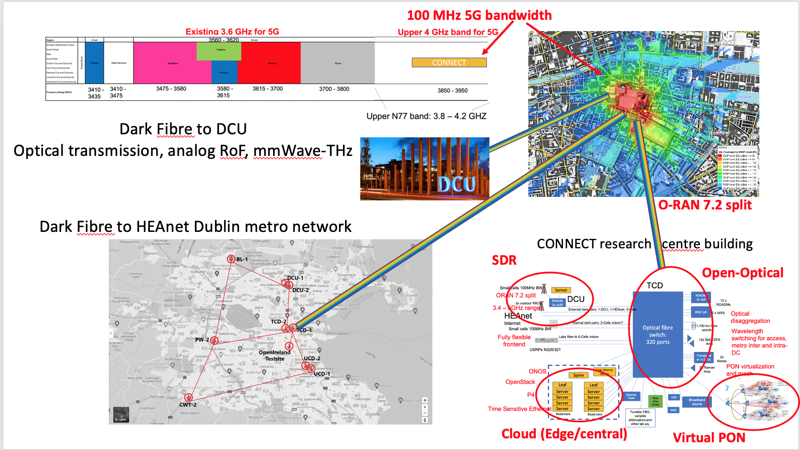
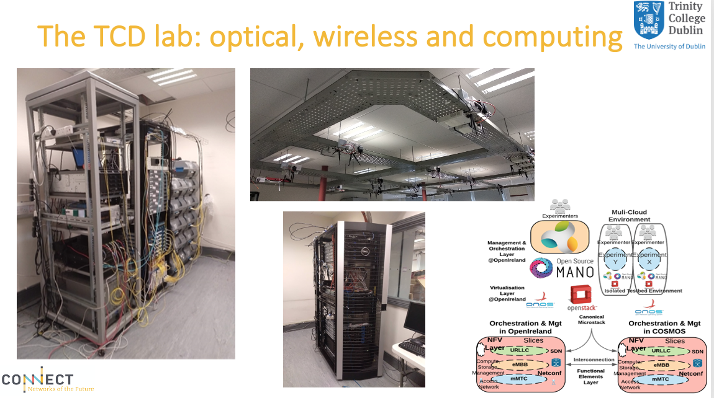
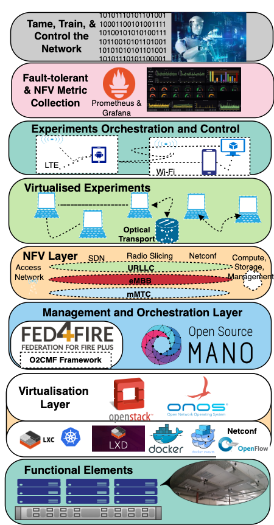

Open Ireland Testbed

# Open Ireland Testbed

OpenIreland - the reconfigurable 5G  and beyond radio, optical, and cloud testbed headquartered at Trinity College Dublin, provides virtualized 5G radio, optical transmission equipment, software virtualisation, Cloud-RAN, Network Functions Virtualisation (NFV), and Software Defined Networking (SDN) technologies (including OpenFlow and Netconf) to support the experimental investigation of the interplay between future networks and new radio. The testbed includes indoor and outdoor 5G new radio, cloud, and optical transmission equipment deployed within Trinity College Dublin, around the Dublin Docklands area, and out to the DCU Campus in North Dublin. ​​

Figure 1: Open Ireland Testbed

Our facility pairs underlying flexible radio, reconfigurable optical access networks and computation resources with various hypervisors in the form of software defined radio (SDR) frameworks, virtualized network functions (VNFs), and SDN network slicing capabilities, running across a multi-tenant and multi-cloud OpenStack environments to realise various reconfigurable research and experimentation configurations. The testbed is principally based on open-source software including Openstack, Open Source MANO (OSM), Goldstone, OpenAirInterface 4G/5G and srsRAN (4G/5G) which are implemented over open interfaces (i.e., O-RAN, ODTN). OpenIreland is ideally equipped to support research towards the combination of SDR and radio slicing, SDN, network functions virtualisation, Quantum communication, and physical layer approaches into coexisting and coherent next-generation commercial networks, including but not limited to 5G. These activities, combined with experiment automation techniques based on unambiguous code, is supporting the evolution of the Iris testbed to support energy efficiency, data collection, and experiment reproducibility.

## Optical Infrastructure

The optical capabilities of the OpenIreland testbed include over 1,700 km of fibre spools, ROADMs, amplifiers, coherent transponders, optical signal and noise monitors, in addition to typical optical laboratory equipment, such as spectrum analyser, real-time scope, optical filters, etc. The testbed is also fully reconfigurable, through the use of a large port count optical fibre switch, which manages the topology for any experiment. This functionality is supported by an SDN control plane primarily using the Nefconf protocol. This gives experimenters the ability to reconfigure the network and experiment equipment. Experimenters can also monitor and collect power and ASE noise and OSNR from optical testbed equipment. An overview of the Optical testbed equipment and network topology is available in Figure 2.

Figure 2: OpenIreland Software Defined Radio Equipment (USRPs), Optical Equipment, and Cloud Architecture

## Cloud and Network Function Virtualisation

Optical and Wireless equipment are connected to a private computational cloud orchestrated primarily by the Canonical suite of technologies including MAAS (Metal as a Service), containers (Docker, LXD, LXC, Kubernetes), cloud platform (OpenStack), and operating systems (Ubuntu), enabling OpenIreland to easily build and deploy multiple isolated testbed environments supporting dynamic virtualised experiments.

To support end-to-end experiment setup and reproducibility in a fully automated way, OpenIreland utilises the Open Source MANO framework, which is an ETSI-hosted project supporting the development of an Open Source NFV Management and Orchestration (MANO) software stack aligned with ETSI NFV. Based on this environment, optical and radio hypervisors combined with dynamic distributed network functions enable the realization of heterogeneous radio and optical platforms that can support malleable and adaptable network configurations.

Figure 3: Open Ireland Cloud Architecture

## Radio Equipment and Resources

Radio resources include 24 NI USRP N210 ([USRP N210 Software Defined Radio (SDR) - Ettus Research](https://www.ettus.com/all-products/un210-kit/) ) ceiling mounted nodes (See Figure 1) equipped with SBX daugtherboards supporting frequency ranges of 400 MHz-4400 MHz offering up to 20 MHz of bandwidth. This equipment supports experimentation with Wi-Fi, WiMAX, S-band transceivers and 2.4 GHz ISM band transceivers, and so forth. We also employ 5 NI USRP X310s ([USRP X310 High Performance Software Defined Radio - Ettus Research](https://www.ettus.com/all-products/x310-kit/) ) supporting DC to 6 GHz frequencies and up to 100 MHz of baseband bandwidth. Additionally the testbed contains B210 USRPs ([USRP B210 USB Software Defined Radio (SDR) - Ettus Research](https://www.ettus.com/all-products/ub210-kit/) ), which provide a fully integrated two-channel USRP device with continuous RF coverage from 70 MHz – 6 GHz Full duplex, MIMO (2 Tx & 2 Rx) operation with up to 56 MHz of real-time bandwidth (61.44MS/s quadrature). All USRPs are connected to the optical and cloud components of the testbed network via optical cables. To expose the functionality of this USRP equipment for applications, we employ a variety of open source radio hypervisors that freely enable prototyping of wireless systems, as exemplified by GNURadio ([GitHub - gnuradio/gnuradio: GNU Radio – the Free and Open Software Radio Ecosystem](https://github.com/gnuradio/gnuradio) ), srsRAN 4G/5G ([GitHub - srsran/srsRAN: Open source SDR 4G/5G software suite from Software Radio Systems (SRS)](https://github.com/srsran/srsRAN) ), and Open-Air Interface 4G/5G ([OpenAirInterface Software Alliance](https://github.com/openairinterface) ). The abstract representation of the different layers of the testbed including Functional Elements (Hardware), Virtualisation Layer, etc., are represented in Figure 3.

# OpenIreland Video Overview

OpenIreland testbed Overview - SFI Summit 2021

<https://www.youtube.com/watch?v=59dkYoqH-58>