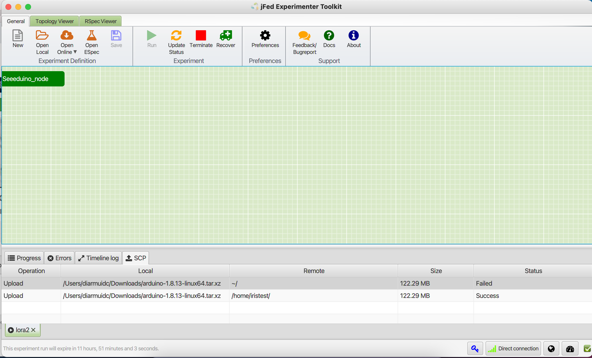
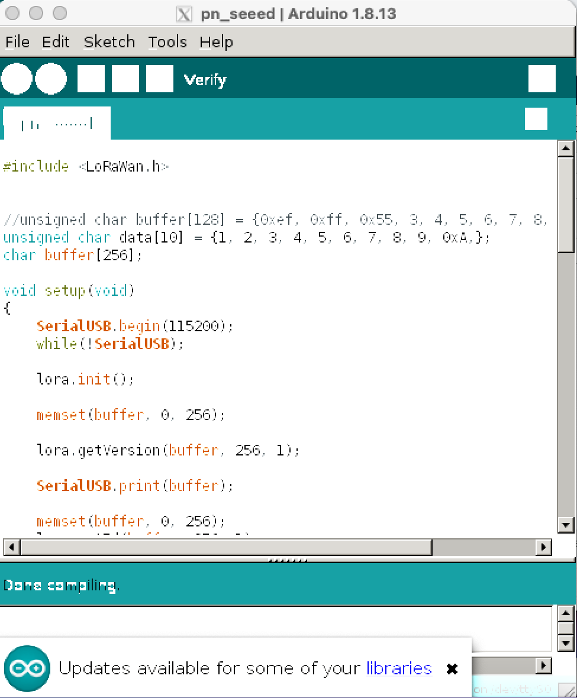
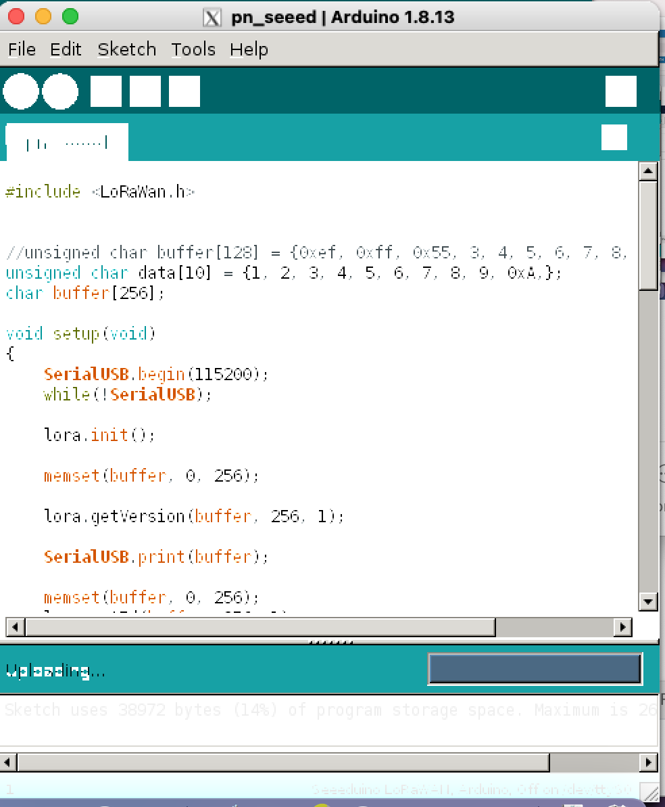
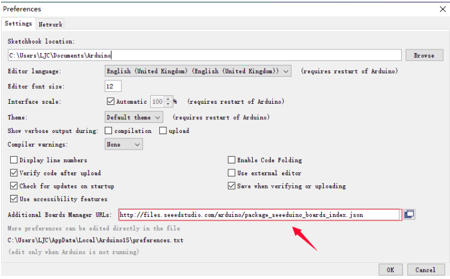
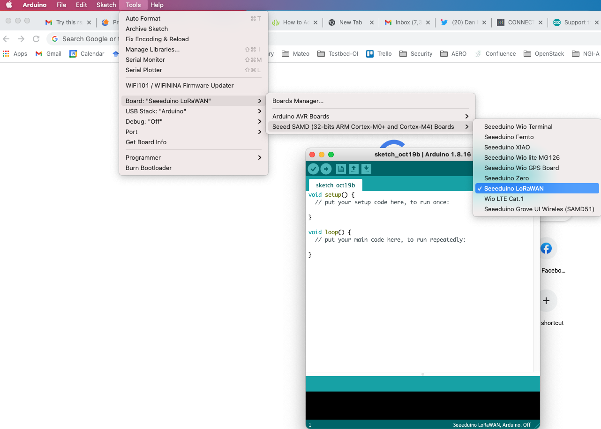
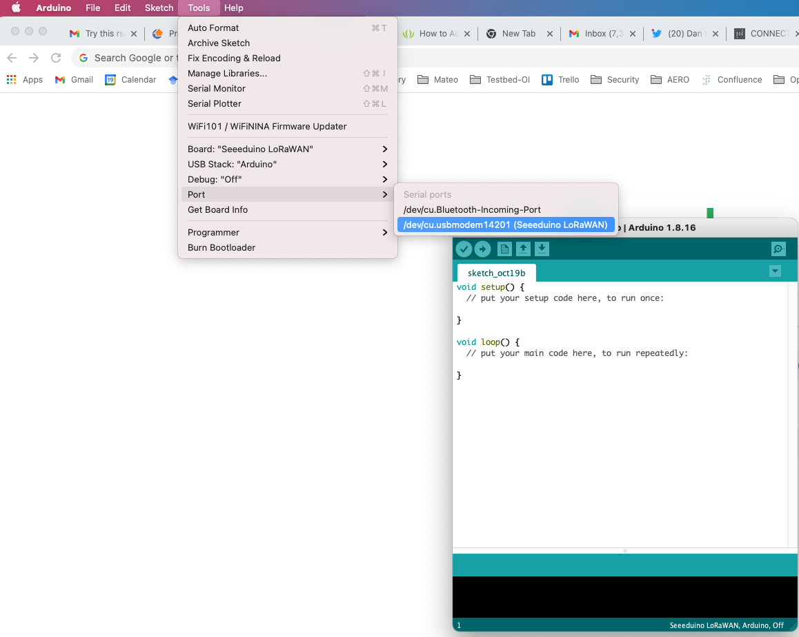
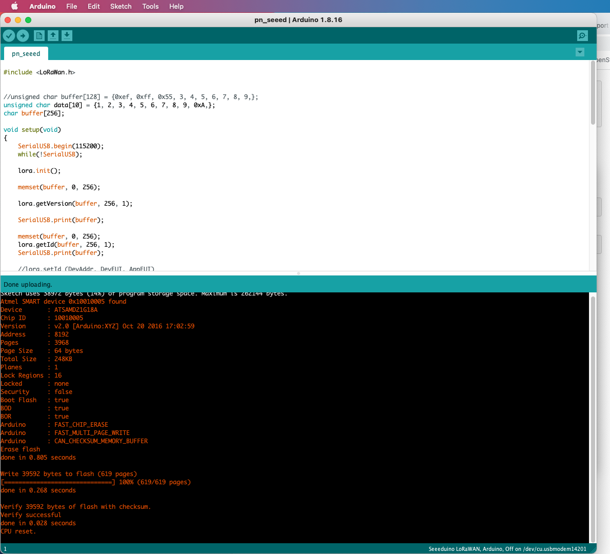
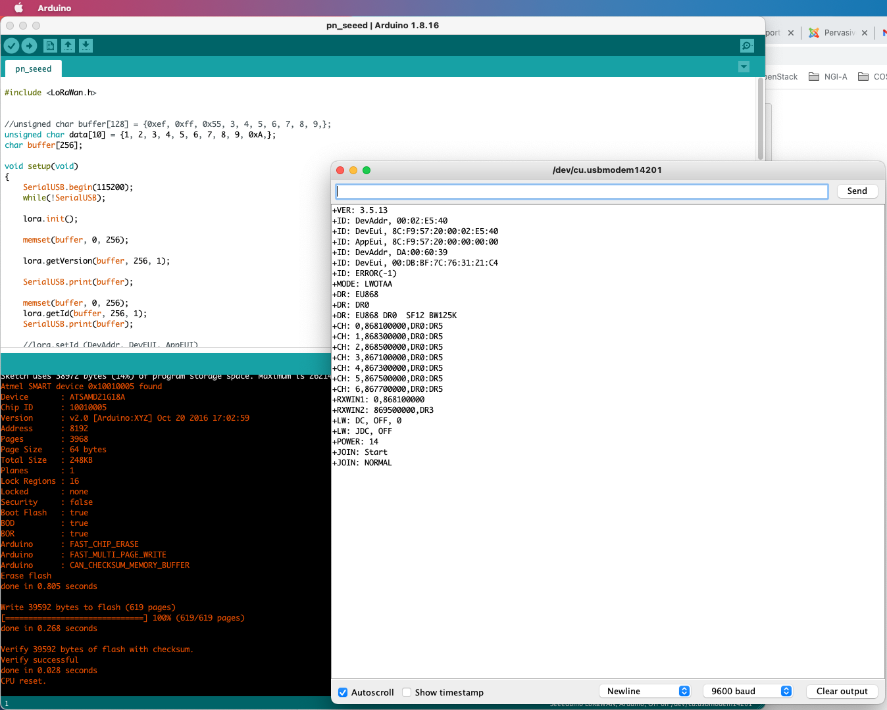

OpenIreland LoRaWAN Tutorial


# OpenIreland LoRaWAN Tutorial

# 2. References

<https://wiki.seeedstudio.com/Seeeduino_LoRAWAN/>

# 3. jFed and Fed4FIRE+ account

Email[**wireless.testbed@connectcentre.ie**](mailto:wireless.testbed@connectcentre.ie)to register for a jfedaccount (also on this URL: <https://portal.fed4fire.eu/> ). You can use your student account at your institute, oralternatively request to join the "pervasivenation" project when registering**(**[**mailto:wireless.testbed@connectcentre.ie**](mailto:wireless.testbed@connectcentre.ie)**)**

# 4. Download jFed Framework

Download jFed client software to run the RSPEC file in the next section

<https://jfed.ilabt.imec.be/downloads/>

# 5. Rspec for Seeeduino LoRAWAN Board at Iris -Support for Pervasive Nation

Load the following rspec, with connected Seeeduino LoRaWAN Board with ubuntu (<https://wiki.seeedstudio.com/Seeeduino_LoRAWAN/> )

```
<?xml version='1.0'?>
<rspec xmlns="http://www.geni.net/resources/rspec/3" type="request" generated_by="jFed RSpec Editor" generated="2022-12-09T10:51:17.720Z" xmlns:emulab="http://www.protogeni.net/resources/rspec/ext/emulab/1" xmlns:jfedBonfire="http://jfed.iminds.be/rspec/ext/jfed-bonfire/1" xmlns:delay="http://www.protogeni.net/resources/rspec/ext/delay/1" xmlns:jfed-command="http://jfed.iminds.be/rspec/ext/jfed-command/1" xmlns:client="http://www.protogeni.net/resources/rspec/ext/client/1" xmlns:jfed-ssh-keys="http://jfed.iminds.be/rspec/ext/jfed-ssh-keys/1" xmlns:jfed="http://jfed.iminds.be/rspec/ext/jfed/1" xmlns:sharedvlan="http://www.protogeni.net/resources/rspec/ext/shared-vlan/1" xmlns:xsi="http://www.w3.org/2001/XMLSchema-instance" xsi:schemaLocation="http://www.geni.net/resources/rspec/3 http://www.geni.net/resources/rspec/3/request.xsd ">
  <node client_id="vm" exclusive="true" component_manager_id="urn:publicid:IDN+iris-open-testbed.connectcentre.ie+authority+am">
    <sliver_type name="vm-seeeduino-iot-dedicated">
      <disk_image name="urn:publicid:IDN+iris-open-testbed.connectcentre.ie+image+seeeduino-board-tutorial"/>
    </sliver_type>
    <location xmlns="http://jfed.iminds.be/rspec/ext/jfed/1" x="75.0" y="25.0"/>
  </node>
</rspec>
```

# 6. Jfed



Make sure that Seeeduino board is connected to the VM at Iris, by running the following command. *dmesg | grepSeeed* - and if the board is there you should see the following information.

```
iristest@seeeduino-node:~$ dmesg | grep Seeed
[ 3.171580] usb 1-1.5: Product: Seeeduino LoRaWAN
[ 3.174509] usb 1-1.5: Manufacturer: Seeed Studio
iristest@seeeduino-node:~$
```

Note, If you cannot see the board using the above command, contact OpenIreland Testbed support team.

# 7. Download the PN TheThingsNetwork GitHub code

Clone the pervasive nation Seeeduino code or copy the contents of the file:

<https://github.com/pervasivenation/pn_seeed/blob/master/pn_seeed.ino>

```
git clone https://github.com/pervasivenation/pn_seeed.git
```

Start arduino if not already started

```
arduino
```

Open the pn\_seeed.ino file

Compile the file - using the "Verify" button



Use the "**Upload"** button to push the code to the board.



Note, you can see debug information from the Serial Monitor

# 8. Install the Seeduino board

Open your Arudino IDE, click on **File > Preferences**, and copy below url to *Additional Boards Manager URLs:*

```
https://files.seeedstudio.com/arduino/package_seeeduino_boards_index.json
```



# 9. Install a board manager

Click on **Toos > Board > Board Manager**.

Now you can search the board by name "Seeduino" and install Seed SAMD Boards


# 10. Set a board

After Step 3 was successful, a board named SeeeduinoLoraWan will show up at the boards list. Select it.

Click on **Tools > Board**, ***SeeeduinoLoraWan > Seeed SAMD (32-Bits ARM cortex - MO+ and Cortex-M4)Boards > Seeeduino LoRaWAN*** is available now. You may need to click this to activate it.



When the LoRaWAN Seeeduino USB device is attached to the machine, its visible in the following screenshot. Youcan now load code to the board to support LoRaWAN seeeduino communication.



Note, if you cannot see the board in Arduino try the following command

```
sudo apt install linux-modules-extra-$(uname -r)
#Reboot the VM and log back in.
sudo reboot
```

Note, If you cannot see the board using the above command, contact OpenIreland Testbed support team.

# 11. Add your user to the dialout group and grantpermission on the Seeduino board

```
sudo usermod -a -G dialout $USER
sudo chmod a+rw /dev/ttyACM0
```

Log out and back in again after running these commands.

# 12. Load the PN LoRaWAN Code, and execute to test it.

Download the PN LoRaWAN Code from GitHub, and use the "Upload" button to upload the code to the Seeeduinoboard.

Enable debug



Enable debug and view the console output.



# Troubleshooting

Error

```
 fatal error: LoRaWan.h: No such file or directory
 #include <LoRaWan.h>
          ^~~~~~~~~~~
compilation terminated.
exit status 1
LoRaWan.h: No such file or directory
```

Search for file LoRaWan.h

```
sudo find / -name LoRaWan.h
```

 Create a symbolic link to the location its expected. If you don’t know what that means google it.

For example:

```
sudo ln -s /home/iristest/Arduino/libraries/Beelan_LoRaWAN/src/lorawan.h /usr/include/LoRaWan.h
```