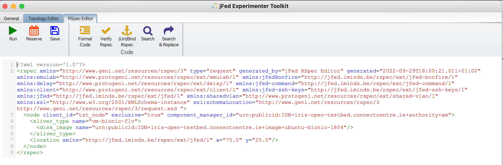
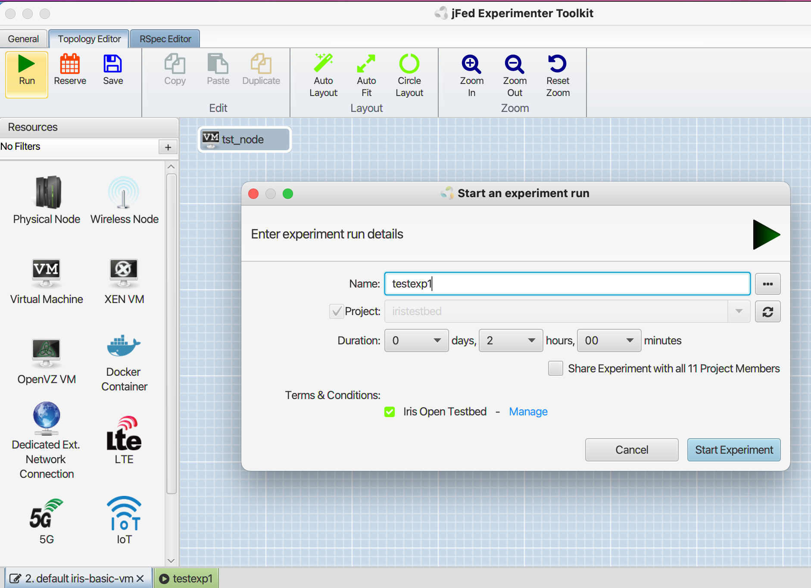
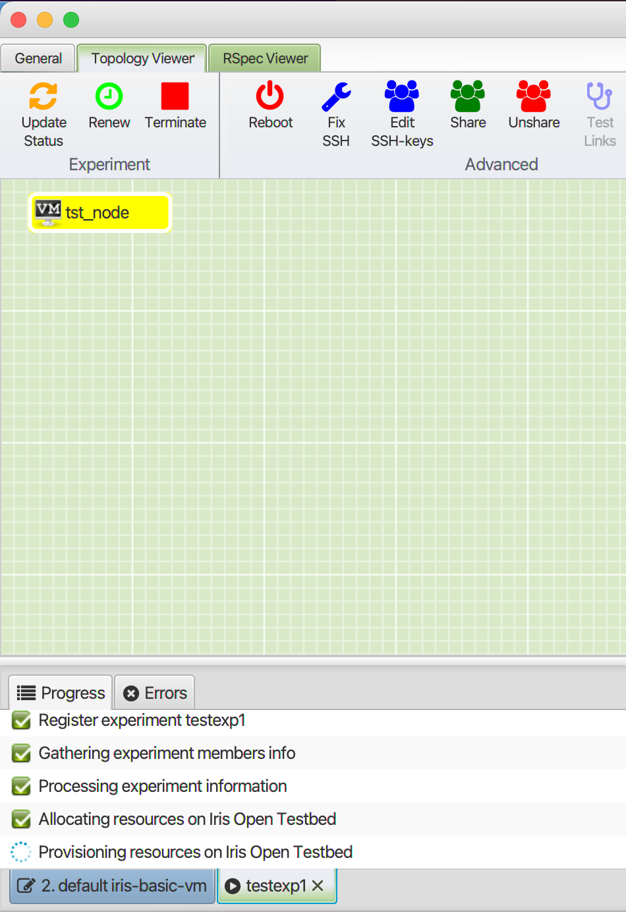
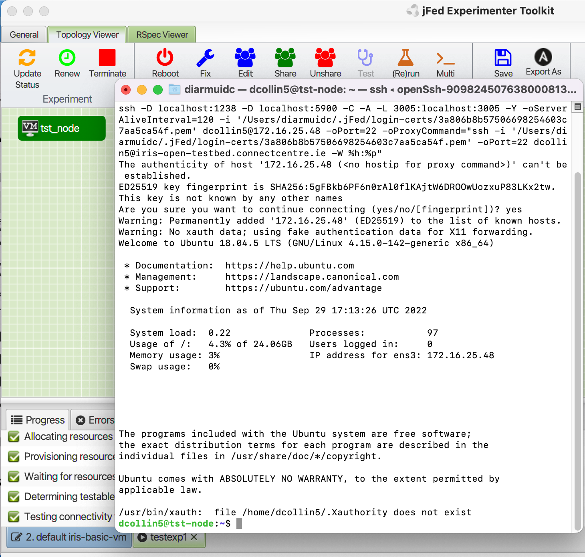
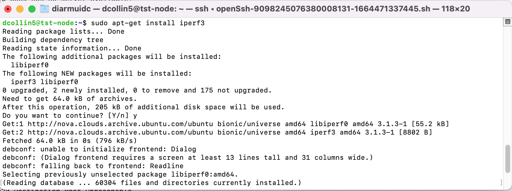

First Experiment - Simple Cloud VM


# First Experiment - Simple Cloud VM

We use the jFed framework, developed by during the Fed4FIRE & Fed4FIRE+ ([fed4fireplue.eu](http://fed4fireplue.eu)) projects, to access the testbed.

You can register to use the jFed framework on the following link:

<https://portal.fed4fire.eu/login>

Can you download the latest jFed framework from the following URL:

<https://jfed.ilabt.imec.be/releases/develop/?C=N;O=D>

or here:

<https://jfed.ilabt.imec.be/downloads/>

It is also possible to join projects. Please contact the testbed support to arrange access.

# First Experiment

Open the jFed framework. Create a new experiment and add the following RSPEC file information to the rspec editor

```
<?xml version='1.0'?>
<rspec xmlns="http://www.geni.net/resources/rspec/3" type="request" generated_by="jFed RSpec Editor" generated="2022-09-29T17:59:18.302+01:00" xmlns:emulab="http://www.protogeni.net/resources/rspec/ext/emulab/1" xmlns:jfedBonfire="http://jfed.iminds.be/rspec/ext/jfed-bonfire/1" xmlns:delay="http://www.protogeni.net/resources/rspec/ext/delay/1" xmlns:jfed-command="http://jfed.iminds.be/rspec/ext/jfed-command/1" xmlns:client="http://www.protogeni.net/resources/rspec/ext/client/1" xmlns:jfed-ssh-keys="http://jfed.iminds.be/rspec/ext/jfed-ssh-keys/1" xmlns:jfed="http://jfed.iminds.be/rspec/ext/jfed/1" xmlns:sharedvlan="http://www.protogeni.net/resources/rspec/ext/shared-vlan/1" xmlns:xsi="http://www.w3.org/2001/XMLSchema-instance" xsi:schemaLocation="http://www.geni.net/resources/rspec/3 http://www.geni.net/resources/rspec/3/request.xsd ">
  <node client_id="tst_node" exclusive="true" component_manager_id="urn:publicid:IDN+iris-open-testbed.connectcentre.ie+authority+am">
    <sliver_type name="vm-bionic-flv">
      <disk_image name="urn:publicid:IDN+iris-open-testbed.connectcentre.ie+image+jammy"/>
    </sliver_type>
    <location xmlns="http://jfed.iminds.be/rspec/ext/jfed/1" x="75.0" y="25.0"/>
  </node>
</rspec>
```

The RSPEC editor should look like the following.



Press “Run”



Enter Experiment “**Name**”: ***testexp1***

**[note, experiment name cant be more than 10characters without spaces or special characters]**

Accept: “Terms & Conditions“

Press “**Start Experiment**”



It will take several minutes for the experiment to create

When the VM Icon goes Green its possible to SSH to the VM



At this point you can begin installing whatever tools required to for your experiment.

Update the os, and then begin installing whatever tools are required.

```
sudo apt-get update
#sudo apt-get install iperf3
```



# Extra Information - more advanced Experiment with Radios and OFDM

This video link can provide some extra information about experimenting on the OpenIreland testbed

<https://www.youtube.com/watch?v=ER_inWEip14&feature=em-subs_digest>
