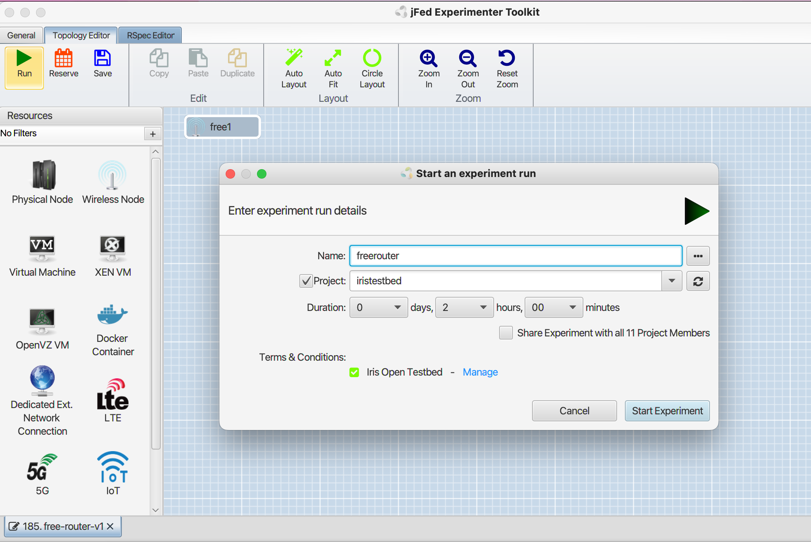
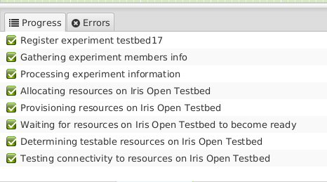
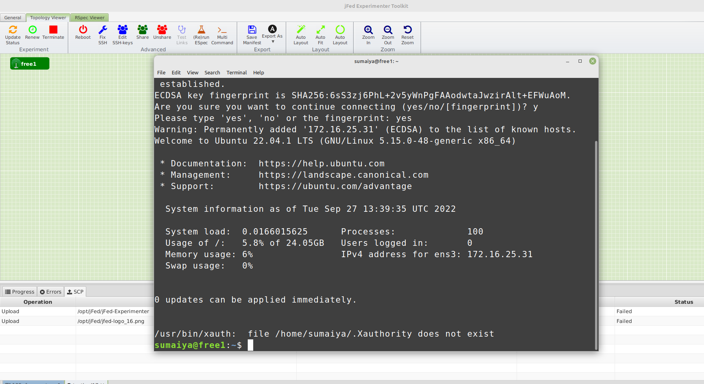
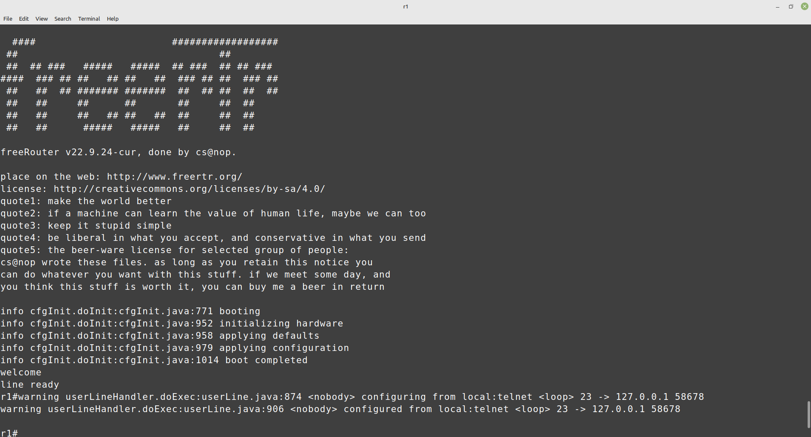
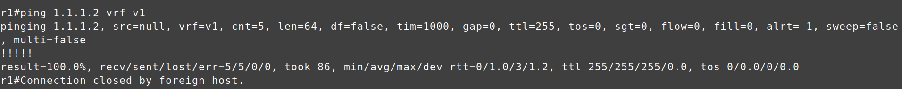
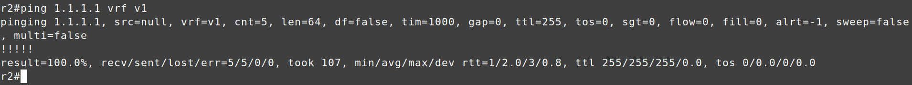

FreeRouter - Tutorial 1


# FreeRouter - Tutorial 1

# References

<https://docs.google.com/document/d/1GuLc0Nf7UbP1mGF6mNKsY4QcyhE0VOsNMimCkfo3xaM/edit>

<https://freerouting.org/freerouting/manual/routing-options>

<http://docs.freertr.org/>

<http://docs.freertr.org/guides/getting-started/001-hello-world/>

# jFed

This software is built to make it very easy for experimenters to provision machines and networks, while on the other side, it also has a lot of functionality for doing advanced experimentation.Using jFed experimenter software, you can use the Open Ireland testbed. Download and register for jfed using the following information.

Jfed Download link:

<https://jfed.ilabt.imec.be/releases/develop/?C=N;O=D>   
You can register to join the jfed rare project here.

<https://portal.fed4fire.eu/invite/rare>

Load the following jFed RSPEC File.

```
<?xml version='1.0'?>
<rspec xmlns="http://www.geni.net/resources/rspec/3" type="request" generated_by="jFed RSpec Editor" generated="2022-09-27T13:50:57.411+01:00" xmlns:emulab="http://www.protogeni.net/resources/rspec/ext/emulab/1" xmlns:jfedBonfire="http://jfed.iminds.be/rspec/ext/jfed-bonfire/1" xmlns:delay="http://www.protogeni.net/resources/rspec/ext/delay/1" xmlns:jfed-command="http://jfed.iminds.be/rspec/ext/jfed-command/1" xmlns:client="http://www.protogeni.net/resources/rspec/ext/client/1" xmlns:jfed-ssh-keys="http://jfed.iminds.be/rspec/ext/jfed-ssh-keys/1" xmlns:jfed="http://jfed.iminds.be/rspec/ext/jfed/1" xmlns:sharedvlan="http://www.protogeni.net/resources/rspec/ext/shared-vlan/1" xmlns:xsi="http://www.w3.org/2001/XMLSchema-instance" xsi:schemaLocation="http://www.geni.net/resources/rspec/3 http://www.geni.net/resources/rspec/3/request.xsd ">
  <node client_id="free1" exclusive="true" component_manager_id="urn:publicid:IDN+iris-open-testbed.connectcentre.ie+authority+am">
    <sliver_type name="vm-bionic-flv">
      <disk_image name="urn:publicid:IDN+iris-open-testbed.connectcentre.ie+image+jammy"/>
    </sliver_type>
    <location xmlns="http://jfed.iminds.be/rspec/ext/jfed/1" x="75.0" y="25.0"/>
  </node>
</rspec>
```

Start Experiment. Enter “project”, Experiment “name“, Accept the Terms and Conditions and then you can set desired period to run the experiment and proceed.




It is also vital to ensure zero error while running the test. If the experiment runs successfully, you can now start installing FreeRtr on the local machine.

# **Install FreeRtr**

```
sudo apt-get install default-jre-headless --no-install-recommends
```

The freeRouter homepage is at <http://freertr.net> . Starting from this page, you'll find various resources such as source code (there is also a GitHub mirror), binaries, and other images that might be of your interest. From there, we just download the freeRouter jar files.

```
wget freertr.net/rtr.jar
```



Open the ssh terminal by clicking the node for configuration.


# Configuration

Two files need to be edited to run the experiment successfully.

* A hardware definition file
* A software configuration file

**Hardware Router1**

This file includes the definition of the router:

* Platform information
* Interfaces definition
* External port translation to freeRtr port namespace
* External process launched and watched by freeRtr

Let's give it the name `$hostname-hw.txt`

* The router we will create is `r1,` so the hardware file is:`r1-hw.txt`
* Use Vi/vim to edit/add/remove any information of the configuration file.

The format of interface declaration is:

int <intf\_name> <intf\_type> <intf\_mac> <ip\_socket\_a> <port\_socket\_a> <ip\_socket\_b> <port\_socket\_b>

tcp2vrf <local host> <vrf definition> <port number>

```
int eth1 eth 0000.1111.0001 127.0.0.1 26011 127.0.0.1 26021
tcp2vrf 1123 v1 23
```

**Software  Router1**

Create another file for the software part of the router. Let's give it the name `$hostname-sw.txt`

* Hostname, ethernet, or should be declared in this file.

freeRouter software configuration file: vi/vm **r1-sw.txt**

```
hostname r1
!
vrf definition v1
 exit
!
int eth1
 exit
!
server telnet tel
 security protocol telnet
 no exec authorization
 no login authentication
 vrf v1
 exit
!
```

**Hardware Router2**

freeRouter hardware file: **r2-hw.txt**

```
int eth1 eth 0000.2222.0001 127.0.0.1 26021 127.0.0.1 26011
tcp2vrf 2223 v1 23
```

**Software  Router2**

freeRouter software configuration file: **r2-sw.txt**

```
hostname r2
!
vrf definition v1
 exit
!
int eth1
vrf forwarding v1
exit
!
server telnet tel
 security protocol telnet
 no exec authorization
 no login authentication
 vrf v1
 exit
!
```

# Let’s start the process

**Launch freeRouters R1 & R2**

For this, you need to open a total of two pairs of ssh terminals—one pair for router one and the other for router 2. You can start with checking the parameters by these commands

```
java -jar /rtr/rtr.jar
java -jar /rtr/rtr.jar <parameters>
parameters:
  router <cfg>            - start router background, config url
  routerc <cfg>           - start router with console, config url
  routerw <cfg>           - start router with window, config url
  routercw <cfg>          - start router with console and window, config url
  routers <hwcfg> <swcfg> - start router from separate configs, config url, config url
  routera <swcfg>         - start router with sw config only, config url
  test <cmd>              - execute test command, command to execute
  show <cmd>              - execute show command, command to execute
  exec <cmd>              - execute exec command, command to execute
```

**R1 launch with supplied r1-hw.txt and r1-sw.txt with a console prompt**

```
#java -jar <path>/rtr.jar routersc <path>/r1-hw.txt <path>/r1-sw.txt
```



**Let’s do this again in another terminal for router 2…**

**R2 launch with supplied r2-hw.txt and r2-sw.txt with a console prompt**

```
#java -jar <path>/rtr.jar routersc <path>/r2-hw.txt <path>/r2-sw.txt
```

after this, you should see the same welcome page, which indicates you are ready for the next steps! Now you can open two terminals to telnet access from the specific ports of router1 and router2.

**R1 telnet access from port 1123**

```
#telnet localhost 1123
```

**R2 telnet access from port 2223**

```
#telnet localhost 2223
```

**R1 &R2 running configuration**

```
r1#?
r1#conf t
r1(cfg)#hostname r1
r1(cfg)#int ethernet1
r1(cfg-if)#vrf forwarding v1
r1(cfg-if)#ipv4 address 1.1.1.1 255.255.255.252
r1(cfg-if)#ipv6 address 1234::1 ffff:ffff:ffff:ffff::
r1(cfg-if)#desc r1@e1 -> r2@e1
r1(cfg-if)#no shut
r1(cfg-if)#end
r1#sh run
r1#sh int
```

```
r2#conf t
r2(cfg)#hostname r2
r2(cfg)#int ethernet1
r2(cfg-if)#vrf forwarding v1
r2(cfg-if)#ipv4 address 1.1.1.2 255.255.255.252
r2(cfg-if)#ipv6 address 1234::2 ffff:ffff:ffff:ffff::
r2(cfg-if)#desc r2@e1 -> r1@e1
r2(cfg-if)#no shut
r2(cfg-if)#end
r2#sh run
r2#sh int
```

**Connectivity test between R1 and R2 & R2 and R1**

```
r1#ping 1.1.1.2 /vrf v1
```

```
r2#ping 1.1.1.1 /vrf v1
```




Congratulations! You have accomplished this experiment using native UNIX UDP socket forwarding! Let’s go to the next tutorial .

# Troubleshooting

You can check whether a specific port is sending/receiving packets or not using this command-

```
sudo tcpdump -i any port 26011 <unix socket>
```

In this experiment, you tried to connect two routers and checked their connectivity. In order to accomplish this test, you needed to open multiple terminals, which could create confusion and increase the complexity of this simple experiment. In that case, **tmux** (terminal multiplexer) can be used which allows you to use multiple terminal windows in one place.