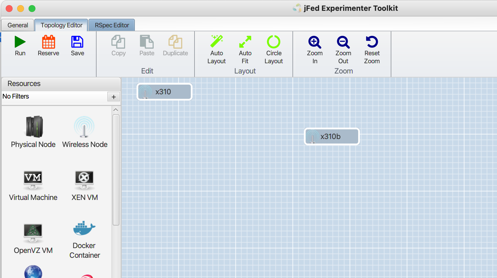
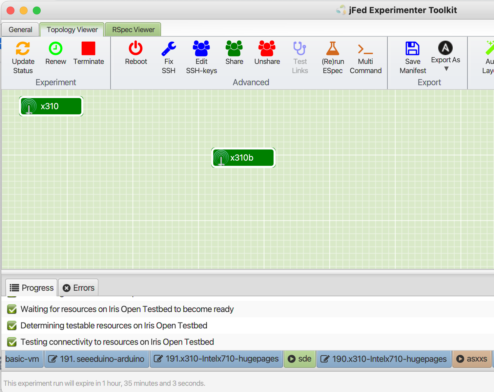

USRP X310 - Optical Integration


# USRP X310 - Optical Integration

This tutorial provides an brief overview of the jfed USRP integration with the OpenIreland Optical Polatis Switch.



RSEPC is as follows:

```
<?xml version='1.0'?>
<rspec xmlns="http://www.geni.net/resources/rspec/3" type="request" generated_by="jFed RSpec Editor" generated="2022-12-16T10:47:35.550Z" xmlns:emulab="http://www.protogeni.net/resources/rspec/ext/emulab/1" xmlns:jfedBonfire="http://jfed.iminds.be/rspec/ext/jfed-bonfire/1" xmlns:delay="http://www.protogeni.net/resources/rspec/ext/delay/1" xmlns:jfed-command="http://jfed.iminds.be/rspec/ext/jfed-command/1" xmlns:client="http://www.protogeni.net/resources/rspec/ext/client/1" xmlns:jfed-ssh-keys="http://jfed.iminds.be/rspec/ext/jfed-ssh-keys/1" xmlns:jfed="http://jfed.iminds.be/rspec/ext/jfed/1" xmlns:sharedvlan="http://www.protogeni.net/resources/rspec/ext/shared-vlan/1" xmlns:xsi="http://www.w3.org/2001/XMLSchema-instance" xsi:schemaLocation="http://www.geni.net/resources/rspec/3 http://www.geni.net/resources/rspec/3/request.xsd ">
  <node client_id="x310" exclusive="true" component_manager_id="urn:publicid:IDN+iris-open-testbed.connectcentre.ie+authority+am" component_id="urn:publicid:IDN+iris-open-testbed.connectcentre.ie+node+x310-10.55.42.0">
    <sliver_type name="vm-m1.large.performance.x310.X710">
      <disk_image name="urn:publicid:IDN+iris-open-testbed.connectcentre.ie+image+jammy"/>
    </sliver_type>
    <location xmlns="http://jfed.iminds.be/rspec/ext/jfed/1" x="75.0" y="25.0"/>
    <interface client_id="x310:ens3">
      <ip address="provider3" type="ipv4"/>
    </interface>
  </node>
  <node client_id="x310b" exclusive="true" component_manager_id="urn:publicid:IDN+iris-open-testbed.connectcentre.ie+authority+am" component_id="urn:publicid:IDN+iris-open-testbed.connectcentre.ie+node+x310-10.55.42.0">
    <sliver_type name="vm-m1.large.performance.x310.X710">
      <disk_image name="urn:publicid:IDN+iris-open-testbed.connectcentre.ie+image+jammy"/>
    </sliver_type>
    <location xmlns="http://jfed.iminds.be/rspec/ext/jfed/1" x="368.0" y="103.5"/>
    <ip address="provider3" type="ipv4"/>
  </node>
</rspec>
```

Note, this particular experiment used the OpenStack flavour: `m1.large.performance.x310.X710`

This flavour has 7 Dedicated CPUs running across 1 NUMA node, running at 3.8GHz clock, with 20GB RAM, with MEM\_PAGE\_SIZE of 2048

Execute the experiment



The latest version of Ubuntu is used, downloaded nightly

To view the USRPs run the following commands

```
sudo apt-get update
sudo apt install net-tools -y
sudo apt-get install libuhd-dev uhd-host -y
```

Benchmark test the USRP.

```
cd /usr/lib/uhd/examples
./benchmark_rate --rx_rate 100e6 --tx_rate 100e6 --duration 30
##You should see output as follows:
Benchmark rate summary:
Num received samples: 302084340
Num dropped samples: 0
Num overruns detected: 0
Num transmitted samples: 308295260
Num sequence errors (Tx): 0
Num sequence errors (Rx): 0
Num underruns detected: 0
Num late commands: 0
Num timeouts (Tx): 0
Num timeouts (Rx): 0
```

For USRP - VM performance trips check out the following link. This might be necessary if the benchmark tests fail.

<https://kb.ettus.com/USRP_Host_Performance_Tuning_Tips_and_Tricks>